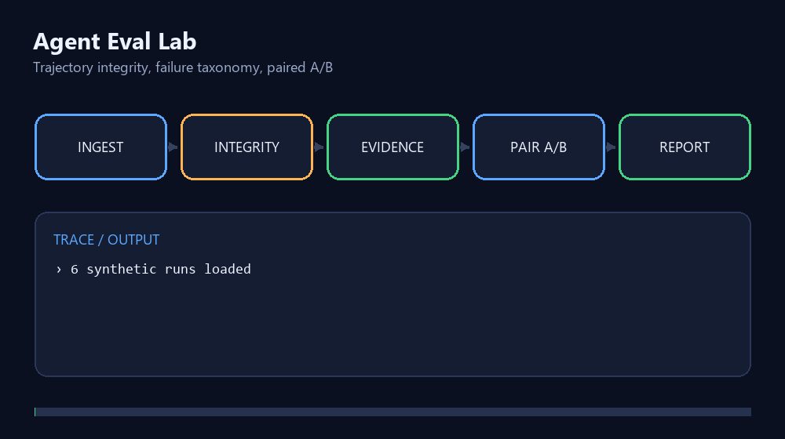

# Agent Eval Lab

[](https://github.com/coolwkx/agent-eval-lab/actions/workflows/ci.yml)
[](https://github.com/coolwkx/agent-eval-lab/releases)
[](LICENSE)

**一个面向 LLM Agent 的可复现评测工具：导入 JSON/JSONL 执行轨迹或 A/B 结果，判断目标是否真正完成，并输出可审计的失败归因、配对统计和任务级置信区间。**

很多 Agent 评测会把“进程正常退出”误当作“用户目标完成”。本项目把两者分开：只有轨迹存在、执行过有效步骤、最终回答非空且成功条件拥有已验证证据，任务才算通过。

> 独立 clean-room 项目。可执行输入只包含合成任务和合成轨迹；另提供明确标注为 aggregate-only 的脱敏作品集汇总。仓库不包含公司代码、内部任务、私有网页、真实用户数据或原始私有轨迹。



查看：[完整架构说明](docs/ARCHITECTURE.md) · [Hard 实验卡](docs/HARD_SUITE_EXPERIMENT_CARD.md) · [中文面试讲解材料](docs/INTERVIEW_GUIDE.md)

作品集导航：[Browser Runtime](https://github.com/coolwkx/browser-agent-runtime-lite) · **Agent Eval Lab** · [Research Agent](https://github.com/coolwkx/open-source-research-agent)

## 在整套 Agent 工程中的位置

本仓库负责“**可信评测**”：接收 Runtime 或业务 Agent 生成的轨迹，区分进程结束、动作完成与用户目标完成，并输出配对统计和失败归因。[Browser Runtime](https://github.com/coolwkx/browser-agent-runtime-lite) 提供可审计执行闭环，[Research Agent](https://github.com/coolwkx/open-source-research-agent) 提供具体应用案例。

## 核心流程

```text
ExperimentManifest + JSON/JSONL
          ↓
      Schema 校验
          ↓
  完整性 + 证据式目标判定
          ↓
 多标签 violations + 主失败
          ↓
配对 A/B + McNemar + Task Bootstrap
          ↓
      可审计 JSON 报告
```

## 能力

- 检查轨迹为空、0 步终止、最终回答为空等运行完整性问题；
- 按任务要求核对经过验证的证据，而不是只检查退出码或状态字符串；
- 区分 `missing_evidence`、`tool_error`、`blocked` 等失败类型；
- 单次失败可同时保留多个 `violations`，并用 `primaryFailure` 给出主归因；旧字段 `failureType` 继续作为兼容别名；
- 条件汇总中的 `failures` 按全部违规标签计数，因此同一次失败运行可能进入多个类别；
- 同时报告全量平均步数和成功任务平均步数，避免“提前失败看起来更省”；
- 对相同任务的 baseline/optimized 结果进行配对比较；
- 使用 `taskId + repeatId + seed` 作为配对主键，重复或缺失配对会立即失败；
- 证据必须由成功的 `tool_result` 事件产出，验证事件的 claim、值和哈希必须与来源一致，最终回答还需显式引用对应 claim；
- 输出 fail→pass、pass→fail 和 McNemar exact p-value；
- 以 `taskId` 为聚类单位进行确定性 Bootstrap，避免把同一任务的多轮重复当成独立样本；
- 用 `ExperimentManifest` 固定模型、提示词哈希、Git commit、数据集哈希、完整任务 ID 集、seed、重复次数和评测器版本；
- CLI 支持 JSON/JSONL 原始轨迹和已评测 A/B 结果，Schema 错误包含精确字段路径；
- 生成结构化 JSON 报告，便于人工复核和后续可视化。

## 快速开始

环境要求：Node.js 22 或更高版本。

```bash
npm install
npm run check
```

仓库同时提供可执行 CLI 和 ESM/TypeScript 库入口；本地执行 `npm pack` 时会自动编译，产物只包含 `dist`、Schema、示例和架构说明。

演示输出：

```text
Agent Eval Lab 合成数据演示
Baseline: 33.33%
Optimized: 100.00%
Fail→Pass: 2; Pass→Fail: 0
McNemar exact p: 0.5000
Task-cluster 95% CI: [0.0000, 1.0000]
报告已生成：reports/demo-report.json
```

这些数字来自仓库内 3 条**合成任务**，只用于演示评测流程，不能作为真实 Agent 能力结论。

## CLI 导入与复算

输入可以是：

- `agent-eval-lab-trajectories-v1`：`manifest + tasks + runs`，由工具执行证据式判定；
- `agent-eval-lab-results-v1`：`manifest + results`，对已有 A/B 结果重新做严格配对和统计。

```bash
npm run evaluate -- --input ./my-runs.jsonl --output ./reports/my-report.json
```

JSONL 每行使用显式记录类型，不能混用 `run` 与 `result`。以下仅展示记录封装的简写结构：

```jsonl
{"recordType":"manifest","data":{"schema":"agent-eval-lab-manifest-v1","experimentId":"..."}}
{"recordType":"task","data":{"taskId":"easy-01","difficulty":"easy","objective":"...","requiredEvidence":["title"]}}
{"recordType":"run","data":{"runId":"baseline-easy-01-r1","taskId":"easy-01","condition":"baseline","repeatId":"r1","status":"completed","events":[]}}
```

完整 Manifest 字段和可直接运行的输入见 [`examples/public-evidence`](examples/public-evidence/README.md)，编辑器/CI 可使用 [`schemas/evaluation-input.schema.json`](schemas/evaluation-input.schema.json)。输入无效时 CLI 返回非零退出码，并显示如 `$.manifest.promptHash`、`$.results[0].pairKey` 这样的错误路径。

公开合成证据包可用一条命令复算：

```bash
npm run evidence:recompute
```

此外，[`examples/portfolio-aggregate`](examples/portfolio-aggregate/README.md) 保存私有受控原型的**脱敏汇总证据**。它可以公开复算成功数、百分比、逐轮 Token 降幅和 Memory 效率算术，但不能从本仓库复现原始私有运行：

```bash
npm run portfolio:validate
```

## 数据结构

`ExperimentManifest` 固定输入实验的身份和版本，并要求完整覆盖 `taskIds`：每条运行都必须带 seed，每个任务必须覆盖全部声明 seed、拥有准确的 `repeatCount` 个配对，且所有任务使用相同的 `repeatId + seed` 调度。`repeatCount` 表示每任务的配对重复总数，允许同一 seed 通过不同 `repeatId` 重复，但不能少于 seed 数量。输出 Artifact 另外记录实际生成报告的 `agent-eval-lab@0.3.0`，避免混淆来源版本和当前工具版本。`TaskSpec` 定义目标、难度和至少一项必需证据；`AgentRun` 保存运行状态和事件；`EvaluationResult` 记录是否通过、多个违规标签、主失败、步数和 Token；`ComparisonReport` 汇总两个条件并计算配对变化与置信区间。

```ts
interface TaskSpec {
  taskId: string;
  difficulty: "easy" | "medium" | "hard";
  objective: string;
  requiredEvidence: string[];
}

interface EvidenceRecord {
  claimId: string;
  value: string;
  sourceEventId: string;
  sourceUrl?: string;
  contentHash?: string;
}

interface ExperimentManifest {
  model: { provider: string; name: string; revision?: string };
  promptHash: `sha256:${string}`;
  codeCommit: string;
  dataset: { name: string; hash: `sha256:${string}` };
  taskIds: string[];
  seeds: number[];
  repeatCount: number;
  evaluatorVersion: string;
}
```

轨迹事件支持 `plan`、`tool_call`、`tool_result`、`verification` 和 `final`。评测器只接受由成功 `tool_result` 产出、且内容未被后续验证事件篡改的结构化证据，并要求最终回答引用所需 claim。

## 为什么不能只看退出码

以下情况进程都可能正常结束，但任务并未完成：

- 模型没有执行浏览器动作就直接回答；
- 页面加载成功，但没有找到用户要求的信息；
- Agent 在浏览器交互后忘记输出最终回答；
- 遇到登录墙或验证码，却错误声称任务完成；
- 工具连续失败，运行器仍返回 `completed`。

因此，本项目把“进程完成、动作完成、目标完成”拆成独立判断，并保留证据与失败类型。

## 目录

```text
src/evaluator.ts   单次轨迹判定与失败归因
src/statistics.ts  配对汇总与 McNemar 检验
src/schema.ts      JSON/JSONL Schema 校验与兼容归一化
src/pipeline.ts    导入、判定、统计与报告编排
src/cli.ts         命令行入口
src/fixtures.ts    明确标注的合成任务和轨迹
src/demo.ts        一键生成示例报告
examples/          可复算、明确标注的数据示例
schemas/           Draft 2020-12 JSON Schema
test/              评测规则与统计测试
reports/           本地生成的报告目录
```

## 当前限制

- 当前公开示例规模很小，仅用于验证工具行为，不能替代真实基准；
- Bootstrap 报告的是任务级聚类百分位区间；任务数很少时区间会很宽，这是预期行为；
- 尚未实现多人盲标一致性分析；
- 没有接入 LLM-as-a-Judge，避免把未经校准的 Judge 当作真值；
- 当前要求每次运行提供 `repeatId`，可选 `seed`，并严格拒绝重复、孤立配对或伪造 `pairKey`；
- 仓库不宣称复现作者私有项目中的 216 次或 180 次实验。
- 作品集汇总只发布已核验聚合值，并明确标记为 `aggregate-only-not-publicly-reproducible`。
- 输出中的 `generatedAt` 是本次复算时间，因此完整 JSON 字节会变化；固定输入和 Bootstrap seed 保证统计值稳定，而不是时间戳逐字相同。

## Roadmap

- 增加人工盲评标注格式与 Judge 校准报告；
- 输出 Markdown 报告和失败分布图；
- 与 `browser-agent-runtime-lite` 的轨迹格式对接。

## 相关项目

- [browser-agent-runtime-lite](https://github.com/coolwkx/browser-agent-runtime-lite)：证据门控、有限恢复的 Browser Agent 最小运行时。

## 开源协议

项目采用 [MIT License](LICENSE)。贡献前请阅读 [CONTRIBUTING.md](CONTRIBUTING.md)，安全问题见 [SECURITY.md](SECURITY.md)。
