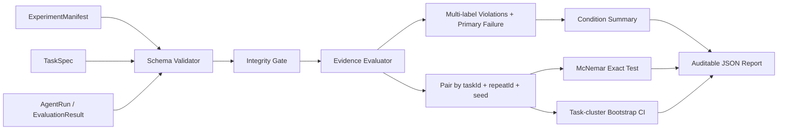
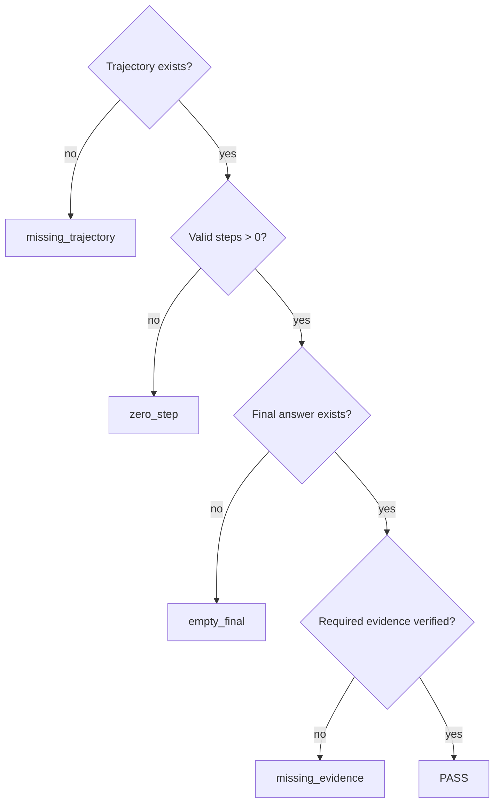

# 架构说明

## 判定逻辑

## 为什么是配对实验

Baseline 和 Optimized 必须在同一个 `taskId + repeatId + seed` 上成对比较。重复或孤立主键会直接报错，禁止静默覆盖。这样既能统计 `fail→pass` 与 `pass→fail`，也能保证总体成功率和 McNemar exact test 使用同一批有效配对。

导入已评测结果时，`pairKey` 必须与三个组成字段重新计算的值一致，避免外部文件通过伪造主键改变配对关系。

## 可复现边界

`ExperimentManifest` 是报告的实验身份证，固定：

- 模型 provider / name / revision；
- 提示词 SHA-256；
- Git commit；
- 数据集名称与 SHA-256；
- 完整任务 ID 集、seed 集合与每任务配对重复总数；
- 评测器版本和数据分类。

Manifest 能说明“什么配置产生了这份报告”，并拒绝任务缺跑、seed 缺失或各任务调度不一致；但它不会自动证明外部模型服务或私有数据从未变化。正式实验仍需保存原始轨迹、环境信息和人工复核记录。

仓库把两类公开材料放在不同目录：`public-evidence` 是可以由公开输入完整复算的 synthetic demo；`portfolio-aggregate` 是私有受控原型的脱敏汇总，只能验证算术与口径。后者明确标记 `aggregate-only-not-publicly-reproducible`，不会伪装成公开实验复现。

## 为什么按任务聚类 Bootstrap

同一个任务的多轮 seed/repeat 共享页面结构、目标和失败模式，不能视为完全独立样本。评测器先按 `taskId` 聚类，再有放回抽取任务簇并聚合簇内所有配对，输出成功率差的确定性百分位区间。固定 seed 让统计值稳定复算；`generatedAt` 会记录每次复算时间，因此完整 JSON 字节不会相同。任务数很小时区间较宽，工具不会隐藏这种不确定性。

## 输入与 Schema

CLI 自动识别标准 JSON 或逐行 JSONL 兼容格式（当前一次读入本地文件）。轨迹输入经过 `TaskSpec`、事件和证据字段校验后再评测；结果输入会兼容补全 v0.2 的单失败字段，但拒绝不一致的 `failureType` / `primaryFailure` / `violations` / `reasons`、伪造 pairKey、重复 runId、任务缺跑、seed 缺失、repeat 数量不符或各任务调度不一致。Schema 错误携带 JSON 路径，适合在 CI 中直接定位数据问题。

## 证据信任边界

`verification` 不能凭字符串自报成功。所声明的 claim、值与内容哈希必须来自一个执行成功的 `tool_result`，最终回答还必须引用该 claim。来源事件缺失、工具失败或值被篡改都会被归类为 `invalid_evidence_source`。

一次运行可以同时违反多条规则，例如“缺少证据”与“工具失败后未恢复”。`violations` 保留全部类别，`primaryFailure` 按稳定规则顺序选择主归因；`failureType` 与主归因保持相同，仅用于兼容旧消费者。
