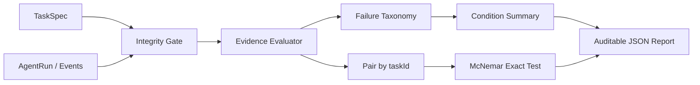
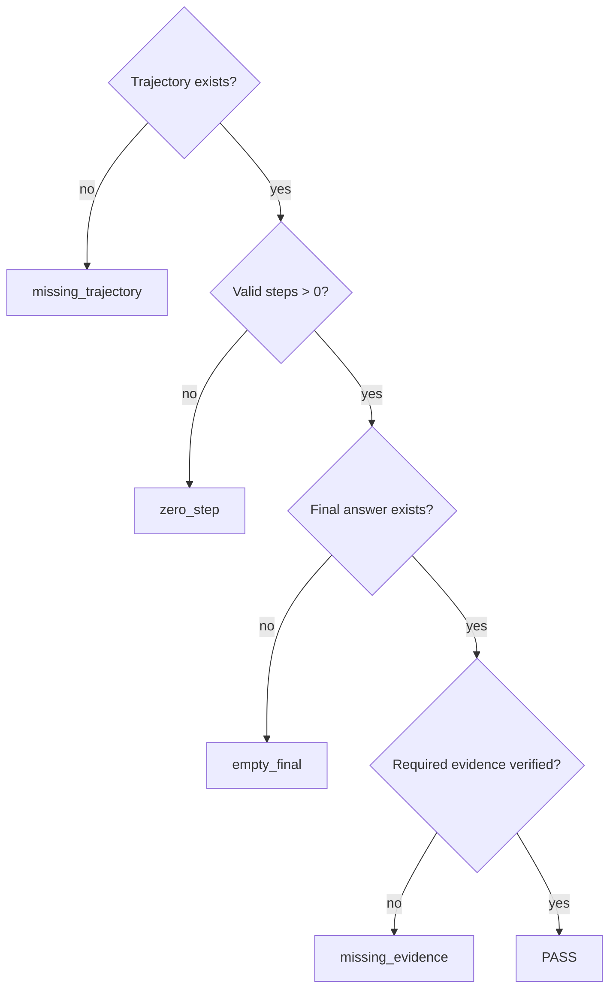

# 架构说明

```mermaid
flowchart LR
    T[TaskSpec] --> I[Integrity Gate]
    R[AgentRun / Events] --> I
    I --> E[Evidence Evaluator]
    E --> F[Failure Taxonomy]
    E --> P[Pair by taskId]
    F --> S[Condition Summary]
    P --> M[McNemar Exact Test]
    S --> J[Auditable JSON Report]
    M --> J
```

## 判定逻辑

```mermaid
flowchart TD
    A{Trajectory exists?} -->|no| X1[missing_trajectory]
    A -->|yes| B{Valid steps > 0?}
    B -->|no| X2[zero_step]
    B -->|yes| C{Final answer exists?}
    C -->|no| X3[empty_final]
    C -->|yes| D{Required evidence verified?}
    D -->|no| X4[missing_evidence]
    D -->|yes| OK[PASS]
```

## 为什么是配对实验

Baseline 和 Optimized 必须在同一个 `taskId` 上成对比较。这样可以统计 `fail→pass` 与 `pass→fail`，避免仅凭两个总体成功率掩盖任务难度差异。McNemar exact test 只使用两类不一致配对判断差异是否显著。
