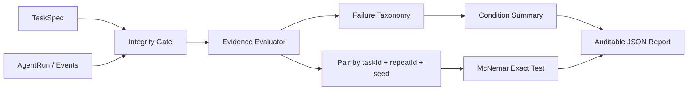
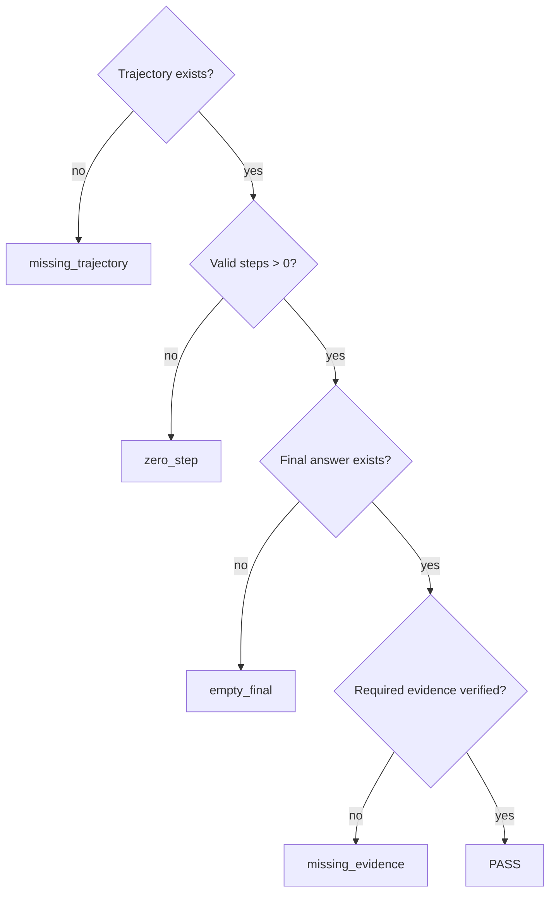

# 架构说明

## 判定逻辑

## 为什么是配对实验

Baseline 和 Optimized 必须在同一个 `taskId + repeatId + seed` 上成对比较。重复或孤立主键会直接报错，禁止静默覆盖。这样既能统计 `fail→pass` 与 `pass→fail`，也能保证总体成功率和 McNemar exact test 使用同一批有效配对。

## 证据信任边界

`verification` 不能凭字符串自报成功。所声明的 claim、值与内容哈希必须来自一个执行成功的 `tool_result`，最终回答还必须引用该 claim。来源事件缺失、工具失败或值被篡改都会被归类为 `invalid_evidence_source`。
